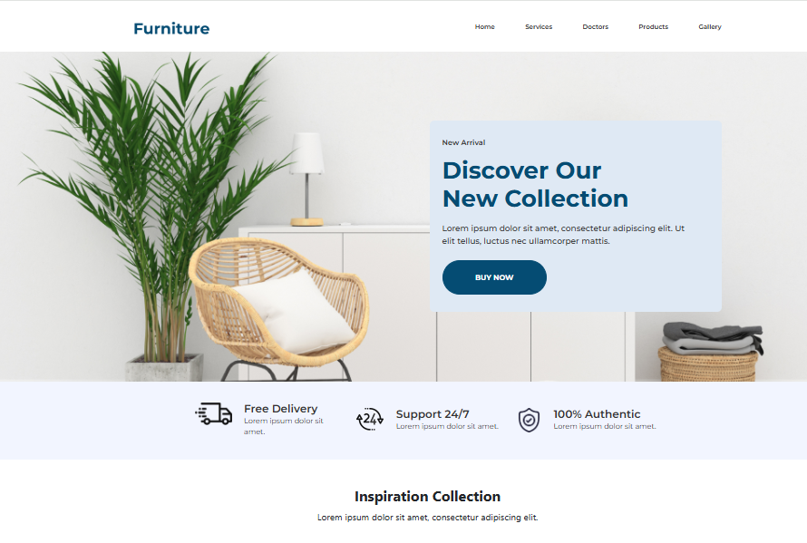

# 🪑 Project-2: Furniture Landing Page

Welcome to the **Furniture Landing Page** — a clean and responsive webpage showcasing a premium furniture brand. Built with **HTML**, **CSS**, and **Bootstrap**, 
this project demonstrates a solid understanding of layout structure, styling, responsiveness, and UI consistency.

🔗 **Live Demo**: [Click to view](https://robimankhinstart.github.io/Project-2-Furniture/)

📁 **Source Code**: [View on GitHub](https://github.com/RobiMankhinStart/Project-2-Furniture)

---

## 📌 Features

- ✅ Modern and clean design
- 📱 Fully responsive layout with Bootstrap
- 🖼️ Hero section with CTA (Call to Action) button
- 🛋️ Product showcase grid
- ✨ Hover effects and transitions
- 📞 Contact section with social icons
- 🌐 Google Fonts integration
- 🎯 Easy-to-navigate layout

---

## 🎯 Purpose of This Project

This project was built as part of my front-end learning journey. It helped me:

- Practice Bootstrap’s grid system and utility classes
- Improve layout skills using flex and responsive design
- Understand the use of media queries and breakpoints
- Work with reusable design components like buttons, cards, and navbars
- Explore animation transitions and hover effects

---

## 🛠️ Tech Stack

- HTML5
- CSS3
- Bootstrap 5

---

## 📸 Screenshot

---

## 💡 Feel free to fork this project and use it as a starter template for your own landing pages!

---

## 🙋‍♂️ Author

- **Robi Mankhin**
- [Facebook](https://www.facebook.com/robi.leo.47/)
- [LinkedIn](https://www.linkedin.com/in/robi-mankhin-608b7b271/)
- [Twitter/X](https://x.com/@robiMankhinDev)
- 📧 mankhinrobi@gmail.com

---
